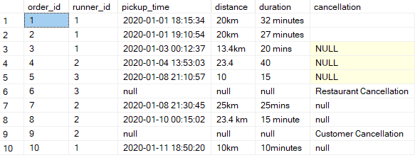
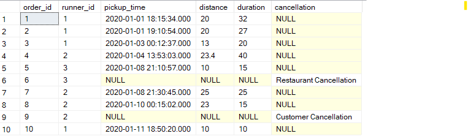
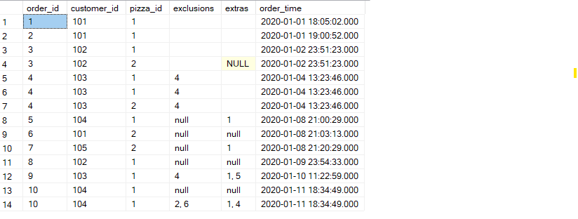
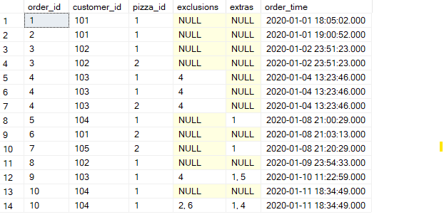

## RunnersOrders Table Clean

```sql
UPDATE RunnersOrders
SET cancellation = null
WHERE cancellation = '' or cancellation = 'null';

UPDATE RunnersOrders
SET duration =
	CASE
		WHEN duration = 'null' THEN null
		WHEN PATINDEX('%[^0-9]%' ,duration) = 0 THEN CAST(duration AS INT)
		ELSE CAST(SUBSTRING(duration, 1, PATINDEX('%[^0-9]%', duration) - 1) AS INT)
		END;

UPDATE RunnersOrders
SET distance =
	CASE
		WHEN distance = 'null' THEN null
		WHEN PATINDEX('%[^0-9.]%' ,distance) = 0 THEN CAST(distance AS FLOAT)
		ELSE CAST(SUBSTRING(distance, 1, PATINDEX('%[^0-9]%', distance) - 1) AS FLOAT)
		END;

UPDATE RunnersOrders
SET pickup_time = null
WHERE pickup_time = 'null';

ALTER TABLE RunnersOrders
ALTER COLUMN pickup_time DATETIME;

ALTER TABLE RunnersOrders
ALTER COLUMN distance FLOAT;

ALTER TABLE RunnersOrders
ALTER COLUMN duration INT;

```
| before | after |
|  |  |


## CustomerOrder Table Clean

```sql
UPDATE CustomerOrder
SET exclusions = null
WHERE exclusions = '' or exclusions = 'null';
--
UPDATE CustomerOrder
SET extras = null
WHERE extras = '' or extras = 'null';
--
ALTER TABLE CustomerOrder
ALTER COLUMN order_time DATETIME;
```
| before | after |
|  |  |

## PizzaName Table Clean

```sql
ALTER TABLE PizzaName
ALTER COLUMN pizza_name VARCHAR(15);
```

## PizzaRecieps Table Clean
```sql
ALTER TABLE PizzaRecieps
ALTER COLUMN toppings VARCHAR(100);
```