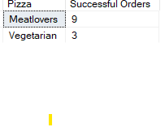
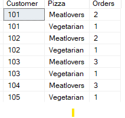
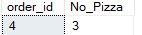
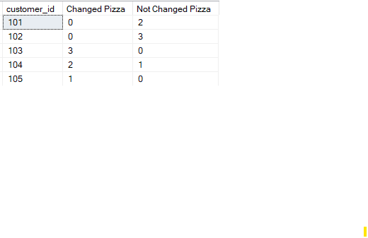
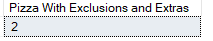
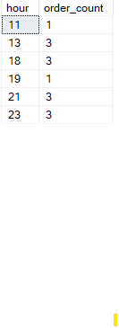
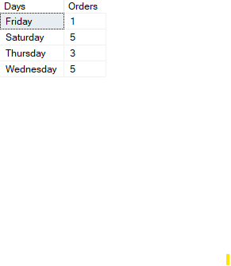

## 1.How many pizzas were ordered?
```sql
SELECT COUNT(pizza_id) [Ordered Pizza Count]
FROM CustomerOrder;
```


## 2.How many unique customer orders were made?
```sql
SELECT COUNT(DISTINCT order_id) [Orders Count]
FROM CustomerOrder;
```


## 3.How many successful orders were delivered by each runner?
```sql
SELECT 
	runner_id Runner
	,COUNT(*) [Successful Orders]
FROM RunnersOrders
WHERE cancellation IS NULL
GROUP BY runner_id;
```


## 4.How many of each type of pizza was delivered?
```sql
SELECT 
	p.pizza_name Pizza
	,COUNT(c.order_id) [Successful Orders]
FROM RunnersOrders r
INNER JOIN CustomerOrder c
ON r.order_id = c.order_id 
INNER JOIN PizzaName p
ON  p.pizza_id = c.pizza_id
WHERE r.cancellation IS NULL
GROUP BY p.pizza_name;
```


## 5.How many Vegetarian and Meatlovers were ordered by each customer?
```sql
SELECT 
	customer_id Customer
	,pizza_name Pizza
	,COUNT(c.pizza_id) [Orders]
FROM 
	CustomerOrder c
	,PizzaName p
WHERE  p.pizza_id = c.pizza_id
GROUP BY pizza_name, customer_id;
```


## 6.What was the maximum number of pizzas delivered in a single order?
```sql
SELECT  TOP 1
	c.order_id
	,COUNT(c.pizza_id) No_Pizza
FROM 
	CustomerOrder c
	,RunnersOrders r
WHERE 
	r.order_id = c.order_id
	and cancellation IS NULL
GROUP BY c.order_id
ORDER BY 2 DESC;
```


## 7.For each customer, how many delivered pizzas had at least 1 change and how many had no changes?
```sql
SELECT  
	customer_id
	,SUM(
		CASE	
			WHEN extras IS NOT NULL OR exclusions IS NOT NULL THEN 1
			ELSE 0
			END
	) [Changed Pizza]
	,SUM(
		CASE	
			WHEN extras IS NULL AND exclusions IS NULL THEN 1
			ELSE 0
			END
	) [Not Changed Pizza]
FROM 
	CustomerOrder c
	,RunnersOrders r
WHERE 
	r.order_id = c.order_id
	AND 
	cancellation IS NULL
GROUP BY customer_id;
```


## 8.How many pizzas were delivered that had both exclusions and extras?
```sql
SELECT 
	COUNT(*) [Pizza With Exclusions and Extras]
FROM RunnersOrders r, CustomerOrder c
WHERE 
	r.order_id = c.order_id
	AND
	exclusions IS NOT NULL
	AND
	extras IS NOT NULL;
```


## 9.What was the total volume of pizzas ordered for each hour of the day?
```sql
SELECT 
		DATEPART(HOUR, order_time) hour
		,COUNT(order_id) order_count
FROM CustomerOrder
GROUP BY DATEPART(HOUR, order_time);
```


## 10.What was the volume of orders for each day of the week?
```sql
SELECT 
	FORMAT(order_time, 'dddd') Days
	,COUNT(order_id) Orders
FROM CustomerOrder
GROUP BY FORMAT(order_time, 'dddd');
```
